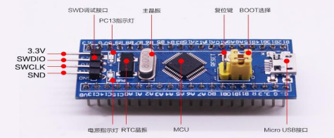
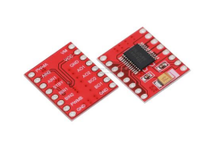
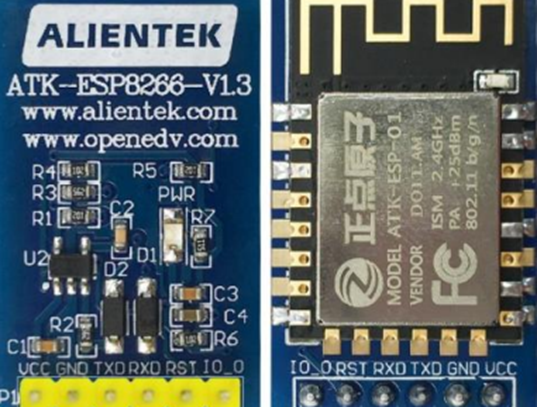
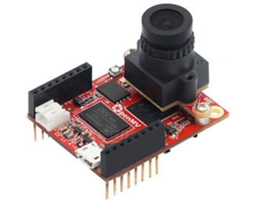
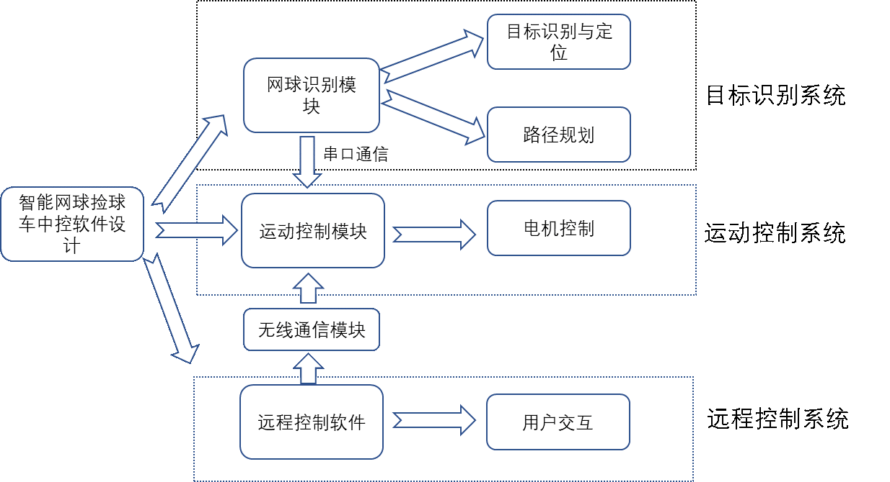
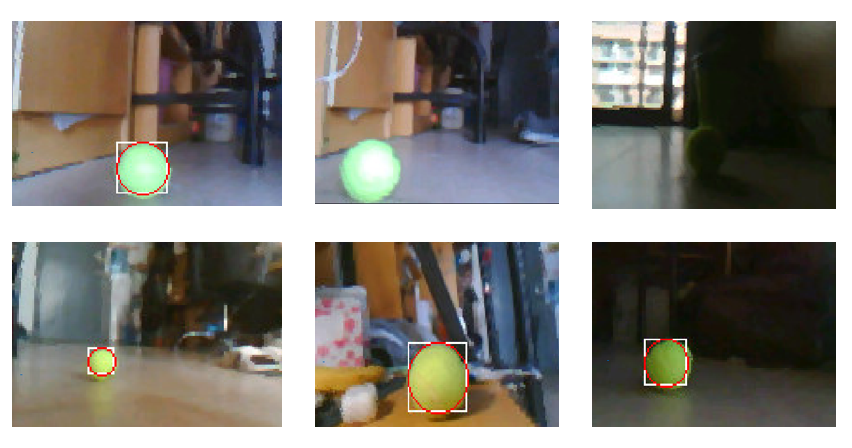
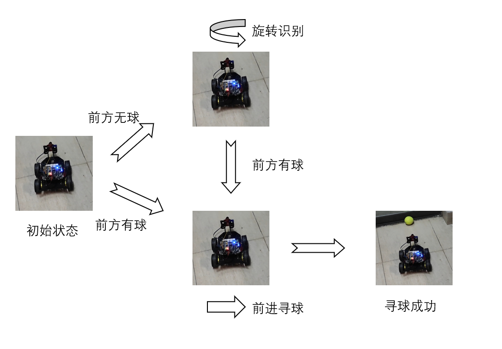
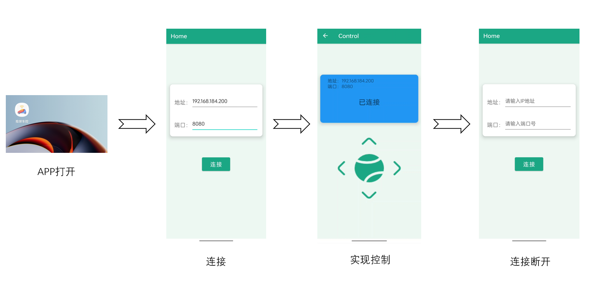

# 智能网球车中控系统

## 项目介绍

设计一款能够自主识别和定位网球的智能网球捡球车的中控软件，同时支持通过远程控制软件进行远程操控，进而实现高效准确地拾取网球，减轻运动员的负担。并且具有以下技术指标：

1. 实现准确控制小车运动的方向、速度。
2. 实现小车能够准确识别和定位网球场上的网球。
3. 整个系统响应速度快，实时性好。

## 安装

### 硬件要求

#### 主控芯片 STM32F103c8t6

#### 电机芯片TB6612

#### WiFi芯片esp8266

#### 摄像头OpenMV

### 软件要求

#### 主控芯片（TennisCar）

STM32CubeMX和Keil

#### WiFi芯片（WiFi）

Arduino

#### OpenMV (OpenMV)

OpenMV IDE

#### 安卓APP（APP）

Android Studio

## 实现思路

整体主要分为目标识别系统、运动控制系统和远程控制系统三个部分，其中远程控制系统和运动控制系统通过无线通信模块进行通信。捡球车通过分析摄像头中所拍摄的画面，准确地识别散落在球场中的球，并对其进行定位与追踪，然后进行路径规划，再由运动控制系统发送清晰的运动指令使得捡球车能够运动到网球附近，对于捡球车遗漏的网球，也可通过远程控制软件完成寻球。

具体来说，对于自动寻球部分，网球识别模块负责场地网球位置的识别，然后将得到的多个网球位置作路径规划，得出的结果输入到控制算法中，输出通过串口通信，传入运动控制模块中，从而PWM波的占空比，进而调节小车运动。对于手动控制捡球部分，使用安卓应用程序作为远程控制软件，它和ESP8266WiFi模块在同一局域网下，并且首先连接WiFi模块，二者通过Socket通信传输数据，进而控制小车完成前后左右、捡球等运动。

## 实现效果

#### 识别效果

#### 操作效果

#### 自动寻球模式

#### 手动寻球模式

# 
